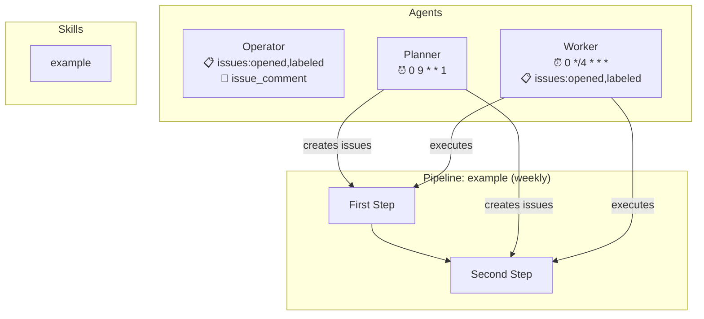

# Factory Architecture

> Auto-generated by `npm run architecture`. Do not edit manually.
> Generated: 2026-04-05T17:39:17.686Z

## Agents

| Agent | Triggers | Timeout |
|-------|----------|---------|
| operator | issues: opened, labeled, issue_comment | 15m |
| planner | schedule: 0 9 * * 1, workflow_dispatch | 30m |
| worker | schedule: 0 */4 * * *, issues: opened, labeled, workflow_dispatch | 60m |

## Pipelines

### example (weekly)

1. **First Step** -> skill: first-step
2. **Second Step** -> skill: second-step (depends on: First Step issue (planner links by issue number))

## Skills

| Skill | Description |
|-------|-------------|
| example | Example skill showing the format. Replace this with your own skill. |
