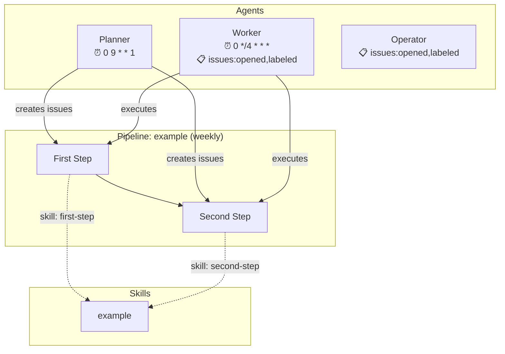

# Architecture Generator

**Date**: 2026-04-05
**Status**: Draft
**Scope**: Template enhancement (depot-template)

## Problem

Dark factories built from depot-template have all their configuration spread across workflow YAML, agent markdown, pipeline definitions, skill files, and the skill map. There's no single view of what the factory does, how agents are triggered, or how pipelines flow. As factories grow, understanding the full picture requires reading many files.

## Goal

A Node.js script that scans all configuration files and generates:
1. A JSON manifest (`docs/architecture.json`) with structured data about the factory
2. A Mermaid diagram (`docs/architecture.md`) showing agents, triggers, pipelines, skills, and data flows

## Constraints

- One external dependency: `js-yaml` for YAML parsing
- Single script file, no build step
- Run with `node scripts/generate-architecture.js`
- Output is a GitHub-renderable markdown file with embedded Mermaid

## What Gets Parsed

| Source | Data Extracted |
|--------|---------------|
| `.github/workflows/depot-*.yml` | Agent name, triggers (schedule/issues/workflow_dispatch), cron expressions, concurrency group, timeout |
| `.claude/agents/*.md` | Agent name, description (from YAML frontmatter) |
| `.claude/pipelines/*.md` | Pipeline name, schedule, steps with dependencies and skill references (from frontmatter + markdown headings) |
| `.claude/skills/*.md` | Skill name, description (from YAML frontmatter) |
| `.claude/SKILL_MAP.md` | Label-to-skill routing (from the markdown table) |

## JSON Manifest Shape

The intermediate `docs/architecture.json`:

```json
{
  "generated_at": "2026-04-05T12:00:00Z",
  "agents": [
    {
      "name": "worker",
      "description": "Task execution agent",
      "workflow": "depot-worker.yml",
      "triggers": [
        { "type": "schedule", "cron": "0 */4 * * *" },
        { "type": "issues", "types": ["opened", "labeled"] },
        { "type": "workflow_dispatch" }
      ],
      "concurrency": "depot-agents",
      "timeout_minutes": 60
    }
  ],
  "pipelines": [
    {
      "name": "example",
      "schedule": "weekly",
      "steps": [
        { "name": "First Step", "labels": ["worker", "first-step-label"], "depends_on": null, "skill": "first-step" },
        { "name": "Second Step", "labels": ["worker", "second-step-label"], "depends_on": "First Step", "skill": "second-step" }
      ]
    }
  ],
  "skills": [
    { "name": "example", "description": "Example skill", "label": "example", "file": ".claude/skills/example.md" }
  ]
}
```

## Mermaid Diagram Output

The script generates `docs/architecture.md` with a Mermaid flowchart showing:

- **Agent nodes** with their trigger types (schedule shown as cron expression, event-driven shown as label)
- **Pipeline flows** showing step dependencies (Step 1 --> Step 2)
- **Skill routing** connecting pipeline steps to skills via dotted lines
- **Data flow arrows** showing planner creates issues, worker consumes them

Example output for the default template:



The markdown file includes a header with the generation timestamp and a note to re-run the script after config changes.

## Script Structure

Single file `scripts/generate-architecture.js` with three phases:

```
parse() --> manifest JSON --> render() --> markdown file
```

Internal functions:
- `parseWorkflows()` - reads `.github/workflows/depot-*.yml`, extracts triggers via js-yaml
- `parseAgents()` - reads `.claude/agents/*.md`, extracts YAML frontmatter
- `parsePipelines()` - reads `.claude/pipelines/*.md`, extracts frontmatter + steps from `### N. Step Name` headings under `## Steps`. Parses `**Labels**`, `**Depends on**`, and `**Skill**` from the bullet list under each step heading.
- `parseSkillMap()` - reads `.claude/SKILL_MAP.md`, extracts the label/file table via regex
- `buildManifest()` - merges all parsed data, cross-references agents with their workflows
- `renderMermaid()` - takes manifest, outputs the Mermaid graph string
- `writeOutput()` - writes both `docs/architecture.json` and `docs/architecture.md`

No classes, no abstractions. Just functions that read files and return data.

## Project Files

- `scripts/generate-architecture.js` - the generator script
- `package.json` - declares `js-yaml` dependency and `"scripts": { "architecture": "node scripts/generate-architecture.js" }`
- `docs/architecture.json` - generated manifest (committed)
- `docs/architecture.md` - generated diagram (committed)

## What Does Not Change

- Workflow files
- Agent prompts
- Pipeline definitions
- Skill files
- SKILL_MAP.md
- Dashboard
- README (beyond optionally linking to the architecture doc)
